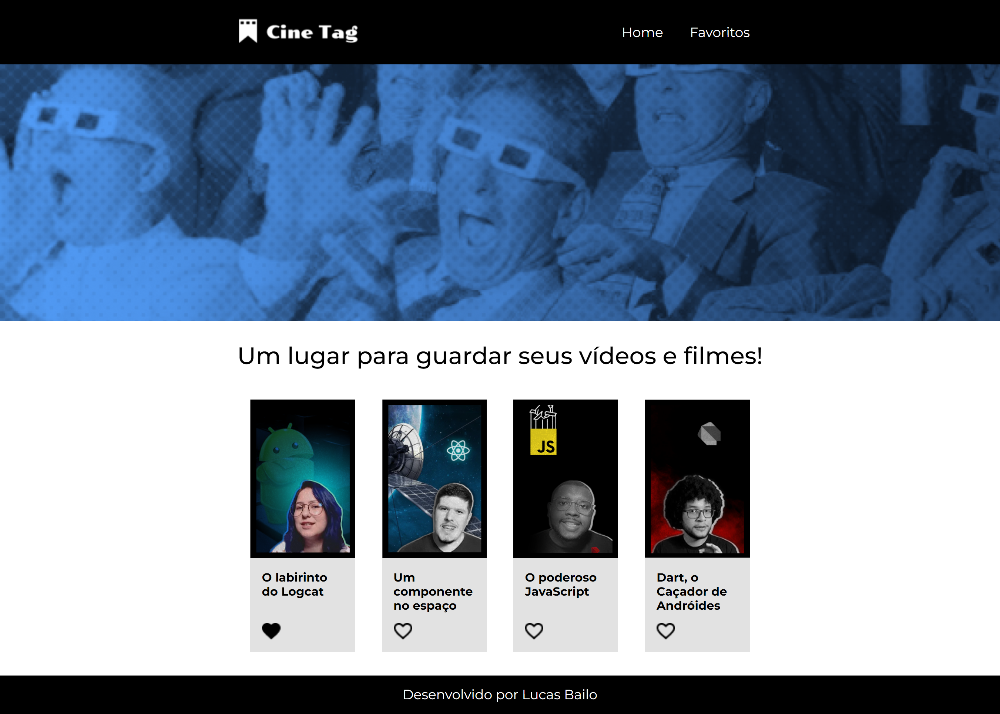
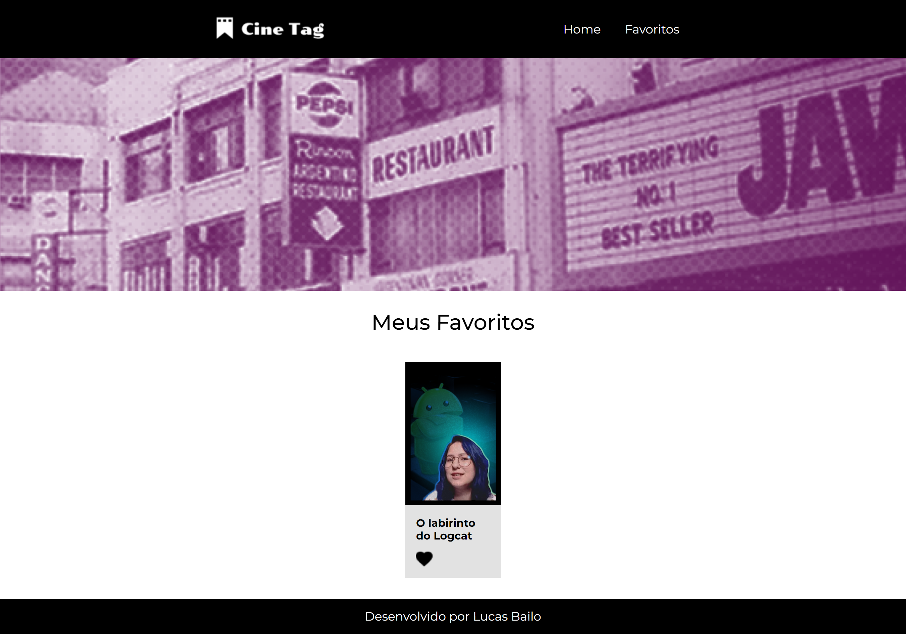

## Welcome again to another React project! 👋

# Cinetag

I'm not DJ Khaled but, ANOTHER ONE!

### Home
- Home page where you can select videos and add you favorite ones.



### Favorites

- Here you can see your favorited videos.



### Player

- Here you can watch the selected video.


### 404 Page

- If you type an incorret address.


## Some code that I'm proud of
```js
function Inicio(){
    const [videos, setVideos] = useState([]);
    useEffect(()=>{
        fetch("https://my-json-server.typicode.com/lucasbailo/cinetag-api-bailo/videos")
            .then(resposta => resposta.json())
            .then(dados => {
                setVideos(dados)
            })
    }, [])
    return(
        <>
            <Banner imagem="home" />
            <Titulo>
                <h1>Um lugar para guardar seus vídeos e filmes!</h1>
            </Titulo>
            <section className={styles.container}>
                {videos.map((video) => {
                    return <Card {...video} key={video.id} />
                })}
            </section>
        </>
    )
}
```

## Built with

- REACT;
- CSS custom properties;
- JavaScript;
- Sweat and tears 😫.

## Test the project yourself: [Teste the project here!!!](https://cinetag-bailo.vercel.app/)

### You can:

- Choose between Routes;
- Click and see diferent videos;
- Add your favorite ones;
- Receive a 404 error message and come back to the previous page.

## Author

- Website - [My GitHub](https://github.com/lucasbailo)
- Frontend Mentor - [@lucasbailo](https://www.frontendmentor.io/profile/lucasbailo)
- Instagram - [@lucassbailo](https://www.instagram.com/lucassbailo/)
- LinkedIn - [Lucas Bailo](https://www.linkedin.com/in/lcsbailo)